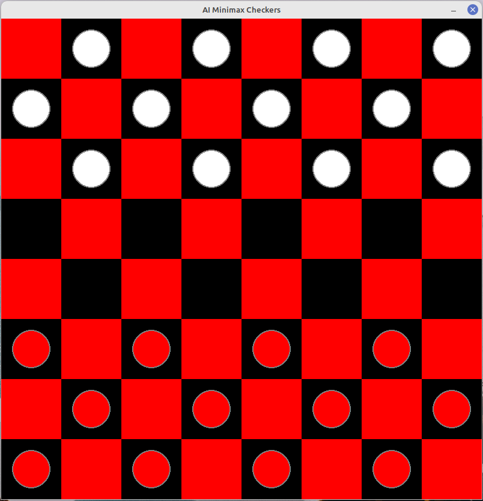

# Pygame AI Checkers

This is a checkers AI game who plays against you (the player.) Here, I follow [This tutorial](https://www.youtube.com/watch?v=vnd3RfeG3NM&list=PLzMcBGfZo4-lkJr3sqpikNyVzbNZLRiT3), and create my own Checkers game for some project research I am doing.

In this project, the Minimax algorithm is implemented as the White AI player.

## Game Board Preview:

 

## Status:

